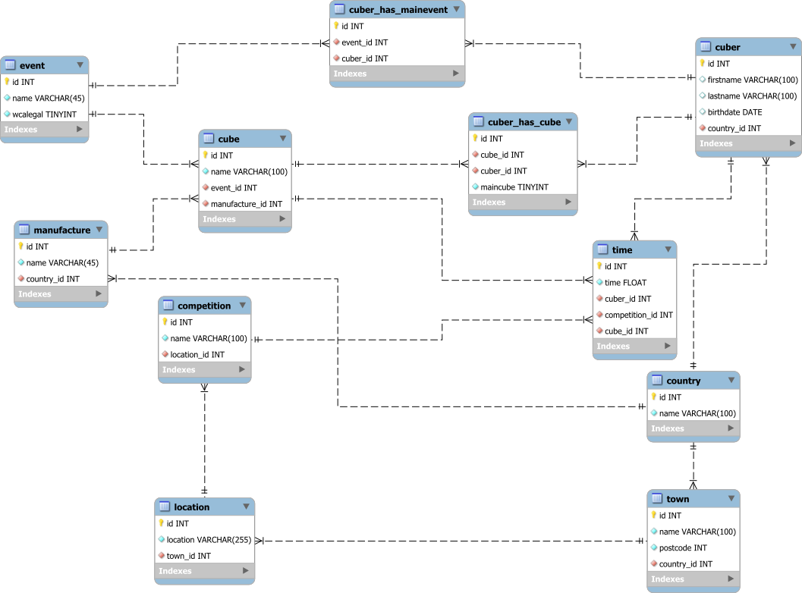

# Cube statistics

## Abstract

This is an API all about cubers, cubes and their times.

It is inspired by the data on
[WCA](https://www.worldcubeassociation.org/)
([Github](https://github.com/thewca))
but obviously made in my style and with many fewer tables.

There are Cubers, Cubes, Times, Events, Competitions, Countries, Towns and Locations.

It is possible to search for each of the above
(Currently only except the times). In the API of the Cuber and the Competition
there are also some extra search functions implemented.

It is made by Kimi Löffel the owner of this project.


## Overview

### Install and run

First you need to clone this repository, you can accomplish this with the following.

```bash
git clone ssh://git@git.bbcag.ch:2222/inf-bl/be/2021/wb/team-h/kimi-l-ffel/cube-statistics.git
```

Then you can open a mysql console and write 

```mysql
source /PATH/TO/THIS/REPOSITORY/cube-statistics/src/main/resources/database/database.sql
source /PATH/TO/THIS/REPOSITORY/cube-statistics/src/main/resources/database/insertdata.sql
```

Or copy the SQL files in the `src/main/resources/database/` folder to your graphical
SQL editor and run them from there in the order `database.sql` then `insertdata.sql`.

Then `cd` into the repository and run the API with the following.

```bash
./gradlew bootRun
```

Then yor API should be ready to be used on Port 8080.

To test if all the data got loaded, open the [Swagger UI](127.0.0.1:8080/swagger-ui.html)
and go to the section cuber-controller.

Go to the first GET method click Try it out
and without entering any queries hit execute.
This should've returned multiple lines of JSON.

### Overview of the database

On my [Entity Relation Diagram](src/main/resources/database/ERD.svg)
you can see the tables, so you can follow the explanation better.

There is a table for the cubers, a cuber can have one or more mainevent/s,
one or more cube/s which could also be their maincube.

A cube has to belong to a manufacture which has to belong to a country.
A cube also has to have an event category, which has the attributes "wcalegal" and "name"
the first describes, if the event is a legal event approved by the 
[WCA](https://www.worldcubeassociation.org/).

A time consists of a cuber, a cube and a competition and obviously a time.

A competition has to have a name, a date and a location. The location consists of a name,
and a town
which has a postcode as well as a name and belongs to a country.

### Entity Relation Diagram of the database



## Information

## What is the WCA

The WCA is the WorldCubeAssociation who organize Competitions,
store your times, the times of every competitor and distribute the official awards.

They also make the official rules on the competitions.

If an event counts as official, this means it is "WCA approved" or in other words,
the WCA makes competitions in this event